# 📚 Library Book Issue System

A Java Swing GUI application developed for **Assignment 3** of Software Construction & Development (SESD3242) at the University of Central Punjab. The application allows students to issue library books through a clean two-column GUI with full exception handling.

---

## 👥 Group Members

| Name | Roll Number |
|------|-------------|
| Abdul Rehman Siddiqui | L1F23BSSE0184 |
| Ayesha Adeel | L1F23BSSE0198 |

---

## 🏫 Course Information

| | |
|---|---|
| **University** | University of Central Punjab (UCP) |
| **Faculty** | Information Technology and Computer Science |
| **Course** | Software Construction & Development |
| **Code** | SESD3242 |
| **Assignment** | Assignment 3 |
| **Deadline** | 24-May-2026 |

---

## 🖥️ GUI Screenshots

### Empty Form
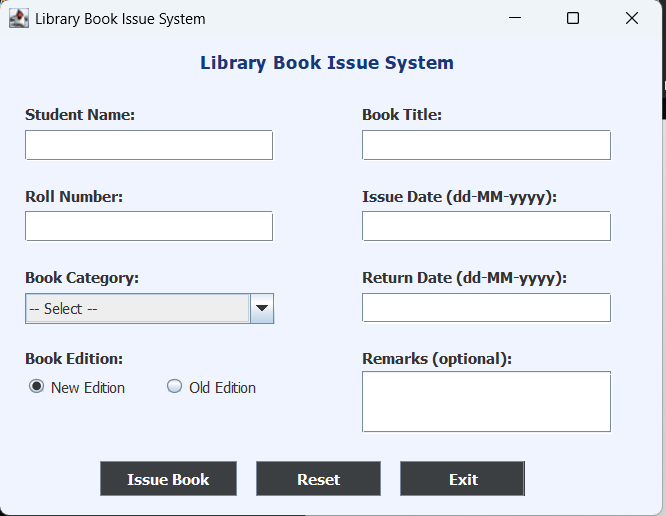

### Filled Form
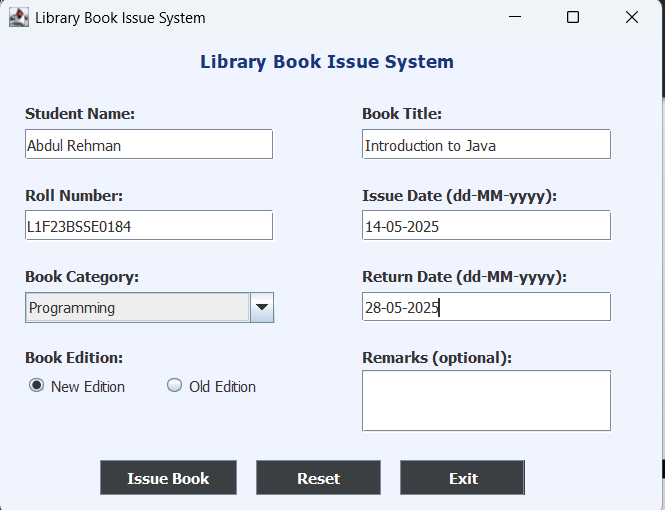

### EmptyFieldException
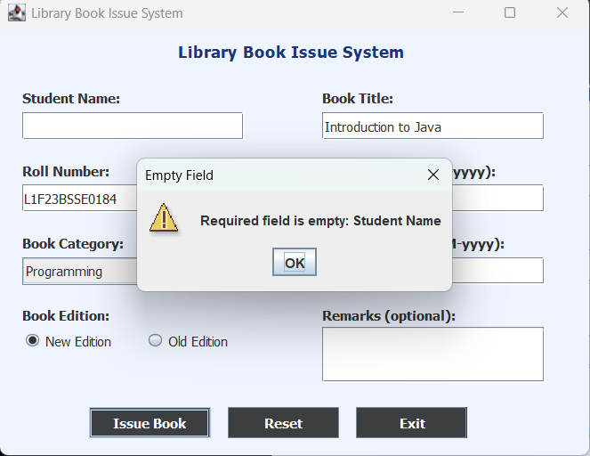

### NullSelectionException
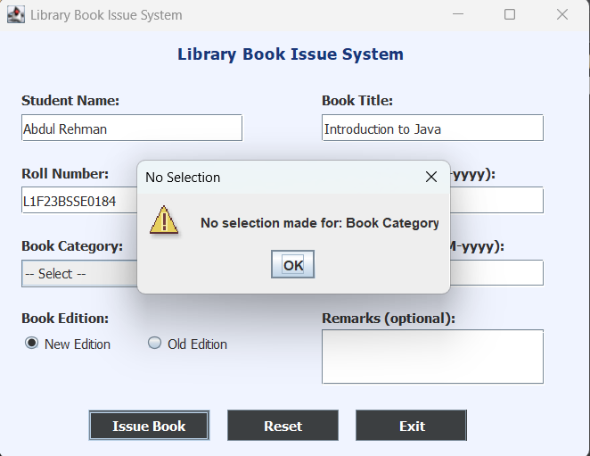

### InvalidRollNumberException
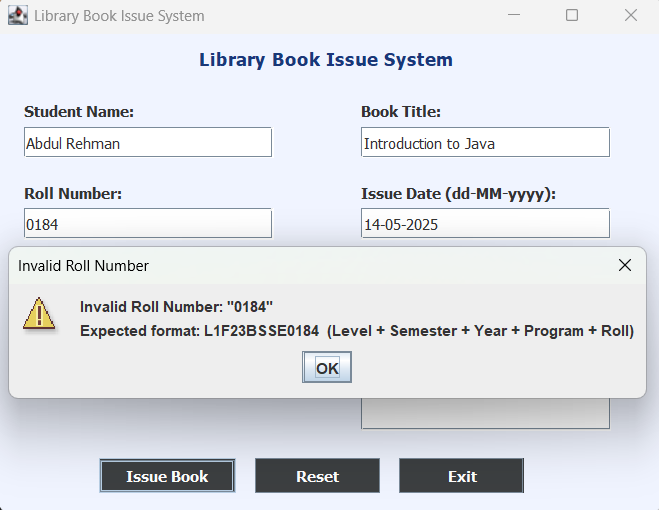

### InvalidDateException
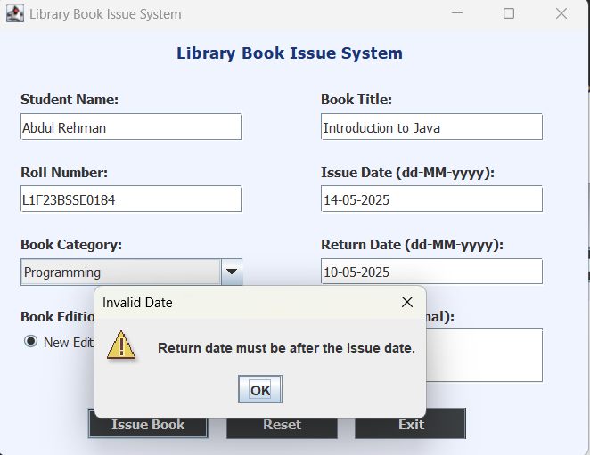

### DateTimeParseException
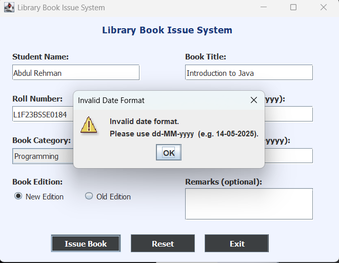

### Success Dialog
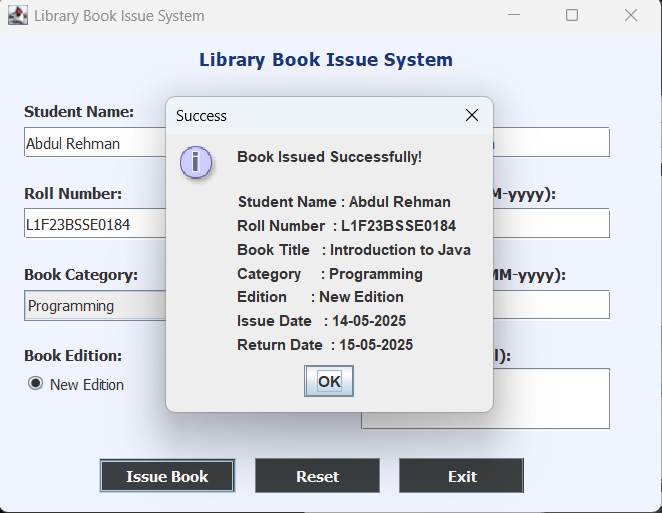

### BookAlreadyIssuedException
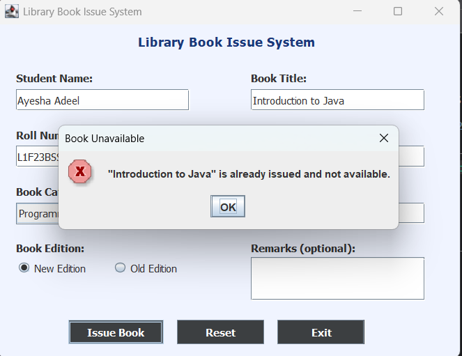

### Finally Block — Operation Completed
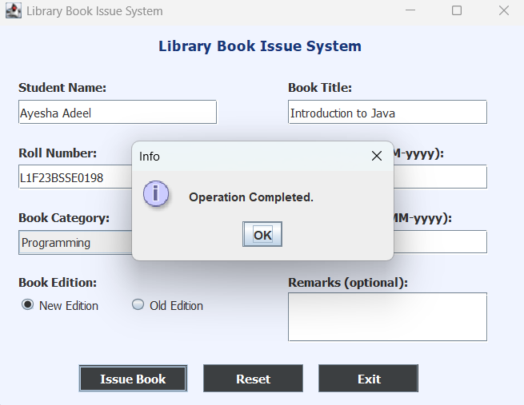

### Exit Confirmation
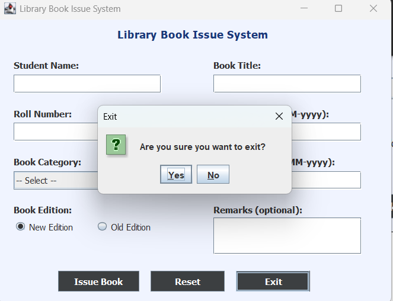

---

## ⚠️ Exception Handling Implemented

| Exception | Type | Trigger |
|-----------|------|---------|
| `EmptyFieldException` | Custom Class | Any required field left empty |
| `InvalidRollNumberException` | Custom Class | Roll number doesn't match format `L1F23BSSE0184` |
| `InvalidDateException` | Custom Class | Return date is before or equal to issue date |
| `NullSelectionException` | Custom Class | Book category not selected from dropdown |
| `BookAlreadyIssuedException` | Custom Class (Mandatory) | Same book title issued twice |
| `NumberFormatException` | Built-in Java | Invalid numeric part in roll number |
| `DateTimeParseException` | Built-in Java | Date entered in wrong format |
| `finally` block | — | Always shows "Operation Completed." after every attempt |

---

## ▶️ How to Run

1. Clone the repository
```bash
git clone https://github.com/AbdulRehman-Siddiqui/Library-Book-Issue-System.git
```
2. Open **Eclipse IDE**
3. Create a new Java project and place `HomeTaskGui.java` inside a package named `HomeTask`
4. Run `HomeTaskGui.java` as a Java Application

---

## 🛠️ Technologies Used

- Java
- Eclipse IDE
- Java Swing (WindowBuilder)
- Git & GitHub
